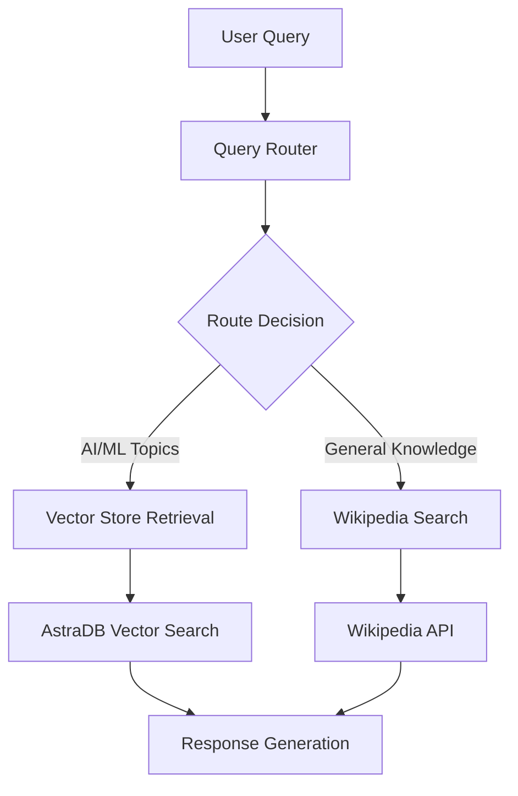

# Smart RAG Router 🤖

An intelligent RAG (Retrieval-Augmented Generation) chatbot that automatically routes queries to the most appropriate data source using LangGraph. The system intelligently decides between querying a specialized vector database(**AstraDB**) or Wikipedia based on the nature of the question.

## 🌟 Features

- **Intelligent Query Routing**: Automatically determines whether to use vector store or Wikipedia search
- **Dual Data Sources**: 
  - Vector store for AI/ML topics (agents, prompt engineering, adversarial attacks)
  - Wikipedia API for general knowledge queries
- **LangGraph Workflow**: State-based conversation flow management
- **AstraDB Integration**: Cloud-native vector database for document storage
- **Web Content Ingestion**: Automatic processing of web articles into searchable chunks

## 🏗️ Architecture



## 🛠️ Tech Stack

- **LangChain & LangGraph**: For building the RAG pipeline and workflow management
- **AstraDB**: Vector database for document storage and similarity search
- **Groq**: LLM provider (Llama 3.3 70B)
- **HuggingFace Embeddings**: Text embedding generation (all-MiniLM-L6-v2)
- **Wikipedia API**: General knowledge retrieval
- **WebBaseLoader**: Web content ingestion

## 📋 Prerequisites

- Python 3.8+
- AstraDB account and credentials
- Groq API key
- Required Python packages (see requirements)

## 🚀 Installation

1. **Clone the repository**
   ```bash
   git clone https://github.com/prakhar175/langgraph-intelligent-rag.git
   cd langgraph-intelligent-rag
   ```

2. **Install dependencies**
   ```bash
   pip install -r requirements.txt
   ```

3. **Set up environment variables**
   Create a `.env` file:
   ```env
   ASTRA_DB_APPLICATION_TOKEN=your_astra_token
   ASTRA_DB_ID=your_database_id
   GROQ_API_KEY=your_groq_api_key
   ```

4. **Initialize the vector database**
   Run the notebook cells to:
   - Load and process web content
   - Create embeddings
   - Store documents in AstraDB

## 💻 Usage

### Basic Query Examples

```python
# AI/ML related query - routes to vector store
inputs = {"question": "What are the types of agent memory?"}
result = app.stream(inputs)

# General knowledge query - routes to Wikipedia
inputs = {"question": "Who is Shah Rukh Khan?"}
result = app.stream(inputs)
```

### Query Routing Logic

The system automatically determines routing based on content:

- **Vector Store**: Questions about agents, prompt engineering, adversarial attacks
- **Wikipedia**: General knowledge, biographical information, current events


## 🔧 Configuration

### Supported Data Sources

1. **Vector Store Sources**: Currently ingests from:
   - Lilian Weng's AI Agent blog post
   - Prompt Engineering guide
   - Adversarial Attacks on LLMs

2. **Wikipedia Integration**: Handles general knowledge queries with automatic fallback

### Customization Options

- **Add new sources**: Extend the `urls` list in the notebook
- **Modify chunk size**: Adjust `chunk_size` and `chunk_overlap` parameters
- **Change embedding model**: Update the HuggingFace model selection
- **Customize routing logic**: Modify the routing prompt and decision criteria

## 🎯 How It Works

1. **Query Analysis**: The router LLM analyzes the incoming question
2. **Source Selection**: Routes to either vector store or Wikipedia based on topic
3. **Information Retrieval**: Fetches relevant information from the selected source
4. **Response Generation**: Combines retrieved information with the query context

## 🚦 Example Workflows

### Vector Store Query Flow
```
User: "What is AI Agents?" 
→ Router: "vectorstore" 
→ AstraDB: Similarity search 
→ Response: AI agent definition and components
```

### Wikipedia Query Flow
```
User: "What is Avengers?" 
→ Router: "wiki_search" 
→ Wikipedia API: Search query 
→ Response: Marvel Comics information
```


## 📄 License

This project is licensed under the MIT License - see the [LICENSE](LICENSE) file for details.
